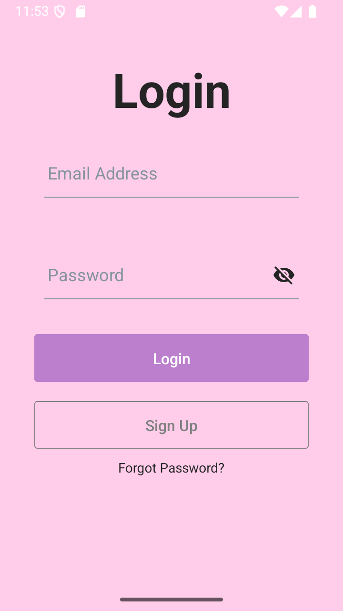
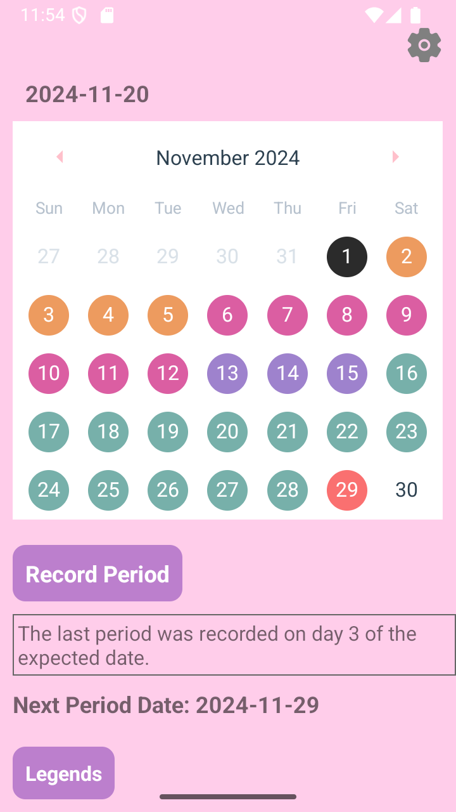
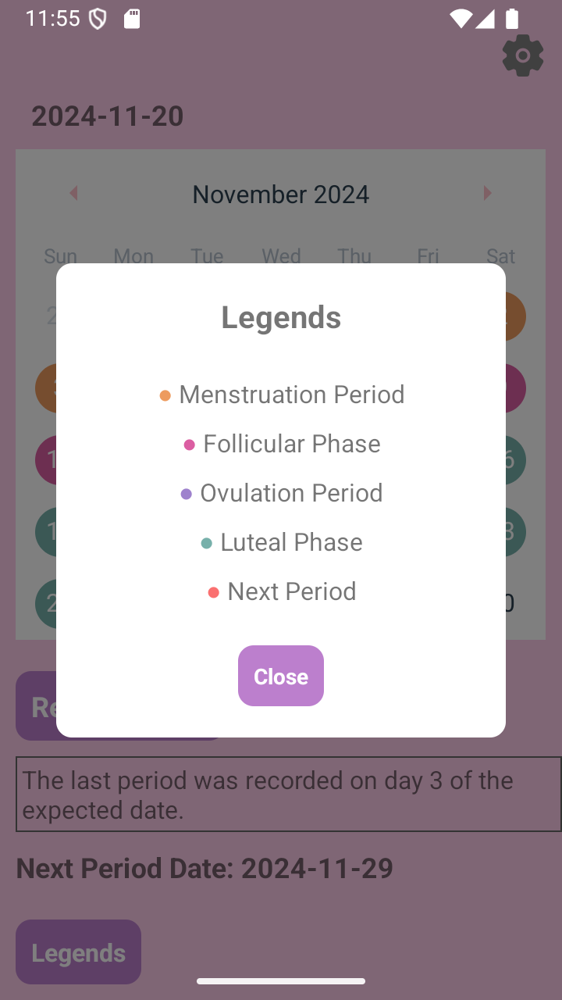
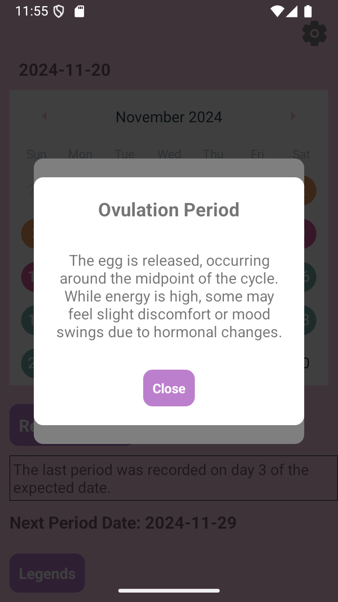

# 📅 Period Tracker

**Period Tracker** is a mobile application built with React Native that helps users track their menstrual cycle and gain valuable insights into their body and health. With an intuitive calendar interface and detailed explanations of cycle phases, this app serves as a handy tool for understanding and managing menstrual health.

---

## 🚀 Features

- **Cycle Calendar**: Visualize different phases of the menstrual cycle with a clear, color-coded calendar.
- **Legend Popups**: Interactive legends explaining each phase (Menstruation, Follicular, Ovulation, and Luteal).
- **Phase Descriptions**: Detailed explanations of how each phase affects the body and mind.
- **Customizable**: Record your period start date, duration, and cycle length for personalized insights.
- **Firebase Integration**: Secure authentication and cloud storage using Firebase.

---

## 🛠️ Tech Stack

- **Language**: TypeScript, JavaScript
- **Framework**: React Native
- **Database**: Firebase Firestore
- **Authentication**: Firebase Authentication
- **UI Components**: react-native-elements, react-native-calendars
- **Icons**: react-native-vector-icons
- **Development Tools**:
  - **Android Studio**: For Android development and emulator testing
  - **Node.js**: For running the development environment and managing dependencies

---

## 📱 Screenshots

<h4>Login Screen</h4>


<h4>Calendar Interface</h4>


<h4>Legends Popup</h4>


<h4>Phase Explanation</h4>


---

## 📝 How to Run the Project

### Prerequisites

- Node.js (v14 or later)
- React Native CLI
- Android Studio / Xcode (for emulator or physical device testing)

### Steps to Run

1. Clone the repository:

   ```bash
   git clone https://github.com/Michi0808/period-tracker.git
   cd period-tracker

   ```

2. Install dependencies:

   ```bash
   npm install

   ```

3. Run the project:

   - For Android:
     ```bash
     npx react-native run-android
     ```
   - For iOS:
     ```bash
     npx react-native run-ios
     ```
   - Ensure that you have a device or emulator running before executing the above commands.

4. Test the Application:

   - Login with test credentials or create a new account to test the authentication flow.
   - Navigate through the calendar to view the menstrual cycle phases and tap on "Legends" for detailed explanations.
   - Record a period start date to see the changes reflected in the calendar and calculations.

## 🧩 Features in Detail

### 📅 Cycle Calendar

- A color-coded calendar displaying the different phases of the menstrual cycle:
  - **Menstruation** (Orange)
  - **Follicular Phase** (Pink)
  - **Ovulation Period** (Purple)
  - **Luteal Phase** (Teal)
- Tapping on a date provides details about the selected phase.

### 📜 Legends and Popups

- The **Legends** button opens a modal explaining the phases with corresponding colors.
- Tapping on a phase in the legend opens a detailed popup describing its physiological and mental effects.

### 🔒 Firebase Integration

- Secure user authentication using Firebase Authentication.
- User-specific period data is stored and retrieved from Firebase Firestore.

### 🛠️ Customization

- Users can:
  - Record the start of their period.
  - Adjust cycle length and period duration for personalized tracking.

## 🌟 Future Improvements

While **Period Tracker** offers a comprehensive set of features, here are some planned improvements to enhance functionality:

- **Notifications**: Reminders for upcoming periods, ovulation, and other important cycle events.
- **Analytics**: Graphical insights into cycle trends and patterns over time.
- **Localization**: Support for multiple languages to make the app more accessible.
- **Dark Mode**: A user-friendly dark theme for better usability at night.
- **Symptom Tracking**: Allow users to log symptoms (e.g., cramps, mood changes) for a holistic health overview.

## 🤝 Contributing

Contributions are welcome! If you’d like to contribute to **Period Tracker**, please follow these steps:

1. Fork the repository.
2. Create a new branch:
   ```bash
   git checkout -b feature/YourFeatureName
   ```
3. Make your changes and commit them:
   ```bash
   git commit -m "Add YourFeatureName"
   ```
4. Push to the branch:
   ```bash
   git push origin feature/YourFeatureName
   5. Open a pull request describing your changes and improvements:
   - Clearly explain the purpose of your changes.
   - Include any relevant screenshots or documentation updates.
   ```

We appreciate all contributions, whether it’s fixing a bug, adding a feature, or improving documentation! For significant changes, please open an issue first to discuss your proposal.

## 🛡️ License

This project is licensed under the MIT License. See the `LICENSE` file for more details.

---

## 🙏 Acknowledgments

- **React Native**: The framework used to build this project.
- **Firebase**: For providing authentication and real-time database services.
- **react-native-calendars**: For the calendar UI component.
- **Sofy.jp**: For providing detailed information about menstrual cycles, which inspired the descriptions.
- Everyone who contributed to improving this project!

Thank you for exploring **Period Tracker**! Your feedback and contributions are highly valued. 😊
